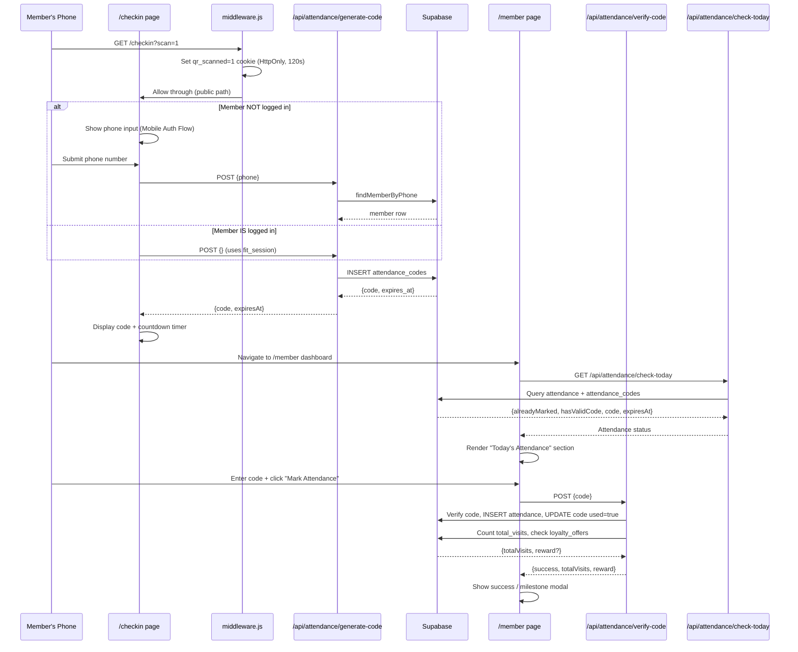

# Design Document — gym-attendance-flow

## Overview

The gym-attendance-flow feature adds a QR-code-driven, two-step attendance system to the existing OptimusCRM. A permanent gym QR code encodes `/checkin?scan=1`. When a member scans it, the server sets a short-lived `qr_scanned` cookie to confirm a physical in-gym scan. The member either authenticates via phone (if not logged in) or is recognized from their existing `fit_session`, then receives a 4-character alphanumeric code valid for 2 minutes. They enter that code on their `/member` dashboard to mark attendance. On a milestone visit, a congratulations modal is shown with the unlocked loyalty reward.

The design builds entirely on the existing stack (Next.js App Router, custom `supabaseFetch` wrapper, `fit_session` cookie, Tailwind CSS, react-icons) with no new dependencies.

---

## Architecture

### High-Level Data Flow



### Component Map

```
middleware.js                   ← Add /checkin to PUBLIC_PATHS; set qr_scanned cookie
app/
  checkin/
    page.jsx                    ← NEW: QR check-in page (phone auth + code display)
  member/
    page.jsx                    ← MODIFIED: add Today's Attendance section
  api/
    attendance/
      generate-code/
        route.js                ← NEW: generate + store 4-char code
      verify-code/
        route.js                ← NEW: verify, mark attendance, check milestones
      check-today/
        route.js                ← NEW: check today's attendance state for member
lib/
  supabase.js                   ← MODIFIED: add findMemberByPhone alias fix,
                                             attendance code CRUD helpers
supabase-schema.sql             ← MODIFIED: attendance_codes DDL (already present)
```

---

## Components and Interfaces

### 1. `middleware.js` — Middleware Changes

**Changes required:**
- Add `"/checkin"` to `PUBLIC_PATHS` so unauthenticated members can access it.
- When a request arrives at `/checkin` with `?scan=1`, set the `qr_scanned` cookie and allow through.
- When an authenticated member (`role = "member"`) visits `/checkin`, the middleware must **not** redirect them away.

**Logic additions:**

```
if (pathname.startsWith("/checkin")) {
  const response = NextResponse.next();
  if (searchParams.get("scan") === "1") {
    response.cookies.set("qr_scanned", "1", {
      httpOnly: true,
      sameSite: "strict",
      maxAge: 120,
      path: "/",
    });
  }
  return response;
}
```

The existing member-redirect rule (`session.role === "member" && pathname !== "/member"`) must be exempted for `/checkin`.

---

### 2. `app/checkin/page.jsx` — Check-In Page (NEW)

**Responsibilities:**
- Detect presence of `qr_scanned` cookie (read via `document.cookie` on client, or via server component cookie read).
- If `qr_scanned` absent → show static "Please scan the QR code at the gym to check in." message only.
- If `qr_scanned` present:
  - If member has `fit_session` → call `POST /api/attendance/generate-code` immediately with no body (session carries identity).
  - If no `fit_session` → show phone input + "Get Code" button → on submit, call `POST /api/attendance/generate-code` with `{phone}`.
- On successful code generation → show 4-char code (large font) + countdown timer.
- On timer expiry → show "Code expired. Tap to generate a new one." + "Generate New Code" button.
- On error (403 QR required, 404 phone not found, 500) → show appropriate inline error message.

**State machine:**

```
IDLE
  → (qr_scanned absent) → BLOCKED ("Please scan QR")
  → (qr_scanned present, logged in) → GENERATING (auto-call generate-code)
  → (qr_scanned present, not logged in) → PHONE_INPUT

PHONE_INPUT
  → (submit phone) → GENERATING

GENERATING
  → (success) → CODE_DISPLAY
  → (error) → PHONE_INPUT (with error message) or BLOCKED

CODE_DISPLAY
  → (timer reaches 0) → EXPIRED

EXPIRED
  → (click "Generate New Code") → GENERATING
```

---

### 3. `app/api/attendance/generate-code/route.js` (NEW)

**Method:** `POST`

**Request body:**
```json
{ "phone": "9876543210" }   // only required when no fit_session present
```

**Server-side logic:**
1. Check `qr_scanned` cookie in request headers. If absent → `403 { error: "QR scan required. Please scan the gym QR code to proceed." }`.
2. Determine `memberId`:
   - If `fit_session` cookie is present and valid → use `session.memberId`.
   - Else if `phone` in body → call `findMemberByPhone(phone)` → if not found → `404 { error: "Mobile number not registered. Please contact the gym." }`.
3. Generate code: 4 uppercase chars from `[A-Z0-9]`. Retry up to 5 times if collision detected among active (unused + unexpired) codes.
4. `INSERT` into `attendance_codes`: `{ member_id, code, expires_at: NOW()+120s, used: false }`.
5. Return `200 { code, expiresAt }`.

**Response shapes:**

| Status | Body |
|--------|------|
| 200 | `{ code: "A7K9", expiresAt: "2025-01-15T10:02:00.000Z" }` |
| 403 | `{ error: "QR scan required. Please scan the gym QR code to proceed." }` |
| 404 | `{ error: "Mobile number not registered. Please contact the gym." }` |
| 500 | `{ error: "Failed to generate attendance code. Please try again." }` |

---

### 4. `app/api/attendance/verify-code/route.js` (NEW)

**Method:** `POST`

**Request body:**
```json
{ "code": "A7K9" }
```

**Auth:** Requires valid `fit_session` cookie with `role = "member"`. Returns `401` if missing.

**Server-side logic (sequential, fail-fast):**
1. Decode session → get `memberId`.
2. Lookup `attendance_codes` where `code = body.code`.
   - Not found → `400 { error: "Invalid code." }`.
3. Check `code.member_id === memberId`.
   - Mismatch → `400 { error: "This code does not belong to your account." }`.
4. Check `code.expires_at > NOW()`.
   - Expired → `400 { error: "Code has expired. Please generate a new one." }`.
5. Check `code.used === false`.
   - Used → `400 { error: "Code has already been used." }`.
6. Check no attendance row for `(memberId, today)`.
   - Duplicate → `400 { error: "Attendance already marked for today." }`.
7. Atomic write:
   a. `INSERT attendance { member_id, attendance_date: TODAY_SERVER, status: "Present" }`.
   b. `PATCH attendance_codes SET used = true WHERE id = code.id`.
   - If either fails → `500 { error: "Failed to mark attendance. Please try again." }`.
8. Count `Present` rows in `attendance` for member → `newTotalVisits`.
9. Query `loyalty_offers WHERE active = true AND interval_unit = 'visits' AND interval_value = newTotalVisits`.
10. Return `200 { success: true, totalVisits: newTotalVisits, reward: {title, offer_type, amount} | null }`.

**Response shapes:**

| Status | Body |
|--------|------|
| 200 | `{ success: true, totalVisits: 42, reward: { title: "10-Visit Reward", offer_type: "percentage", amount: 10 } \| null }` |
| 400 | `{ error: "<specific message from steps 2–6>" }` |
| 401 | `{ error: "Unauthorized." }` |
| 500 | `{ error: "Failed to mark attendance. Please try again." }` |

**Atomicity note:** Because the custom `supabaseFetch` wrapper uses the Supabase REST API (not a transaction endpoint), true DB-level atomicity requires sequential calls with error handling. If the attendance INSERT succeeds but the code UPDATE fails, the code must be retried. Since the unique constraint on `(member_id, attendance_date)` will catch double-marking, a partial failure is safe to retry on the next attempt.

---

### 5. `app/api/attendance/check-today/route.js` (NEW)

**Method:** `GET`

**Auth:** Requires valid `fit_session` cookie with `role = "member"`. Returns `401` if missing.

**Server-side logic:**
1. Decode session → `memberId`.
2. Query `attendance` for `(memberId, today)` → `alreadyMarked: boolean`.
3. Query `attendance_codes` for `member_id = memberId AND used = false AND expires_at > NOW()` → most recent row.
4. Return combined status.

**Response shape:**
```json
{
  "alreadyMarked": false,
  "hasValidCode": true,
  "code": "A7K9",
  "expiresAt": "2025-01-15T10:02:00.000Z"
}
```

---

### 6. `app/member/page.jsx` — Today's Attendance Section (MODIFIED)

On page load, in addition to existing `/api/me` and `/api/loyalty-offers` fetches, add:
- `GET /api/attendance/check-today` → stored in `attendanceStatus` state.

**Render logic for "Today's Attendance" card:**

```
if alreadyMarked:
  → Show green "Attendance marked for today ✓" badge
else if hasValidCode:
  → Show code input field + "Mark Attendance" button + remaining time hint
else:
  → Show attendance stats only (last visit, total visits, this month)
     No input field, no button
```

**On "Mark Attendance" submit:**
1. `POST /api/attendance/verify-code { code: inputValue }`.
2. On success:
   - Update `totalVisits` display.
   - If `reward !== null` → show congratulations modal.
   - Else → show inline "Attendance marked successfully!" message.
   - Re-query `check-today` to update section state.
3. On error → show inline error message from API.

**Congratulations Modal:**
- Title: "🎉 Milestone Reached!"
- Body: "You've completed [N] visits. [Offer Title] Unlocked!"
- Reward line: "[amount]% Membership Renewal Discount Unlocked" OR "₹[amount] Membership Renewal Discount Unlocked"
- "Close" button dismisses the modal.

---

### 7. `lib/supabase.js` — New Helper Functions (MODIFIED)

**Fix:** The login route imports `findMemberByPhone` which already exists in `supabase.js`. No rename needed — the import in `login/route.js` is correct.

**New functions to add:**

```js
// Check today's attendance for a member
export async function getTodayAttendance(memberId) { ... }

// Get active unexpired unused attendance code for a member
export async function getValidAttendanceCode(memberId) { ... }

// Create a new attendance code
export async function createAttendanceCode(memberId, code, expiresAt) { ... }

// Find attendance code by code string (for verification)
export async function findAttendanceCode(code) { ... }

// Mark attendance code as used
export async function markCodeUsed(codeId) { ... }

// Count total Present attendance for a member
export async function countMemberVisits(memberId) { ... }

// Get matching visit-milestone loyalty offers
export async function getVisitMilestoneOffer(visitCount) { ... }
```

---

## Data Models

### Existing tables (relevant columns)

**`members`**
| Column | Type | Notes |
|--------|------|-------|
| id | uuid PK | |
| name | text | |
| phone | text unique | Used for Mobile Auth Flow lookup |
| total_visits | integer | May be null; fall back to COUNT of attendance rows |
| status | text | 'Active' / 'Inactive' |

**`attendance`**
| Column | Type | Notes |
|--------|------|-------|
| id | uuid PK | |
| member_id | uuid FK → members | |
| attendance_date | date | UNIQUE with member_id |
| status | text | 'Present' / 'Absent' |
| created_at | timestamptz | |

**`loyalty_offers`**
| Column | Type | Notes |
|--------|------|-------|
| id | uuid PK | |
| title | text | |
| offer_type | text | 'percentage' / 'fixed' |
| amount | numeric | |
| interval_unit | text | 'days' / 'months' / 'years' / **'visits'** (new) |
| interval_value | integer | e.g. 10 for "every 10 visits" |
| active | boolean | |

### New table: `attendance_codes`

| Column | Type | Constraints |
|--------|------|-------------|
| id | uuid | PK, default gen_random_uuid() |
| member_id | uuid | FK → members(id) ON DELETE CASCADE, NOT NULL |
| code | text | NOT NULL |
| created_at | timestamptz | DEFAULT now() |
| expires_at | timestamptz | NOT NULL |
| used | boolean | NOT NULL, DEFAULT false |

**Index:** `CREATE INDEX idx_attendance_codes_code ON attendance_codes(code)` (for fast lookup by code value during verification).

**Schema DDL** (already added to `supabase-schema.sql`):
```sql
CREATE TABLE IF NOT EXISTS attendance_codes (
  id uuid PRIMARY KEY DEFAULT gen_random_uuid(),
  member_id uuid NOT NULL REFERENCES members(id) ON DELETE CASCADE,
  code text NOT NULL,
  created_at timestamptz NOT NULL DEFAULT now(),
  expires_at timestamptz NOT NULL,
  used boolean NOT NULL DEFAULT false
);
CREATE INDEX IF NOT EXISTS idx_attendance_codes_code ON attendance_codes(code);
```

### Schema modification: `loyalty_offers.interval_unit`

The existing `CHECK` constraint only allows `('days', 'months', 'years')`. It must be altered to include `'visits'`:

```sql
ALTER TABLE loyalty_offers DROP CONSTRAINT loyalty_offers_interval_unit_check;
ALTER TABLE loyalty_offers ADD CONSTRAINT loyalty_offers_interval_unit_check
  CHECK (interval_unit IN ('days', 'months', 'years', 'visits'));
```

(Already present in `supabase-schema.sql`.)

---

## Error Handling

### Middleware errors
- Invalid or tampered `fit_session` cookie → `readSession` returns null → treated as unauthenticated.
- `/checkin` with no `?scan=1` → `qr_scanned` cookie is not set; page renders blocked state client-side.

### generate-code errors
| Condition | HTTP | Message |
|-----------|------|---------|
| `qr_scanned` cookie absent | 403 | "QR scan required. Please scan the gym QR code to proceed." |
| Phone not found | 404 | "Mobile number not registered. Please contact the gym." |
| DB insert fails | 500 | "Failed to generate attendance code. Please try again." |

### verify-code errors
| Condition | HTTP | Message |
|-----------|------|---------|
| Not authenticated | 401 | "Unauthorized." |
| Code not found | 400 | "Invalid code." |
| member_id mismatch | 400 | "This code does not belong to your account." |
| Code expired | 400 | "Code has expired. Please generate a new one." |
| Code already used | 400 | "Code has already been used." |
| Attendance already exists | 400 | "Attendance already marked for today." |
| DB write fails | 500 | "Failed to mark attendance. Please try again." |

### check-today errors
| Condition | HTTP | Message |
|-----------|------|---------|
| Not authenticated | 401 | "Unauthorized." |
| DB unreachable | 200 | Returns `{ alreadyMarked: false, hasValidCode: false }` as safe default |

### Client-side errors
- All API errors are displayed inline in the relevant section (no silent failures).
- Network errors show "Something went wrong. Please try again."
- Countdown timer reaching 0 clears the code input and disables the "Mark Attendance" button.

---

## Security Considerations

### QR Scan Enforcement
The `qr_scanned` cookie is `HttpOnly` and `SameSite=Strict`, so it cannot be set by JavaScript or cross-site requests. It is set exclusively by the middleware when the server processes a request to `/checkin?scan=1`. This means a member can only obtain the cookie by physically scanning the QR code at the gym (or navigating to that exact URL on the same device/browser session, which is an acceptable limitation for a gym context).

### Code Ownership Binding
Every `attendance_codes` row stores `member_id`. The verify-code route checks `code.member_id === session.memberId` before accepting the code. A member cannot use another member's code even if they learn it.

### Server-Side Date
The `attendance_date` is always computed server-side as `new Date().toISOString().slice(0, 10)`. The client never supplies the date, preventing backdating attacks.

### One-Attendance-Per-Day
Enforced at two levels: (1) application logic in verify-code checks for an existing row before inserting, and (2) the `UNIQUE(member_id, attendance_date)` constraint in the database will reject duplicate inserts even in a race condition.

### Code Expiry and Single-Use
Codes expire after 120 seconds (`expires_at`) and are marked `used = true` after redemption. Both conditions are checked before any write. This limits the window for code interception and prevents replay.

### Session Cookie
The `fit_session` cookie is `httpOnly: false` per existing code (client reads it for `getClientSession()`). This is a pre-existing design decision. The verify-code route reads it server-side via `request.cookies`, which is unaffected by the `httpOnly` flag.

### Input Validation
- Phone numbers are stripped of non-digits before lookup.
- Code input is uppercased and trimmed before submission.
- No user-supplied values are interpolated directly into SQL — all queries go through parameterized Supabase REST filter syntax (`?code=eq.${value}`).

---
